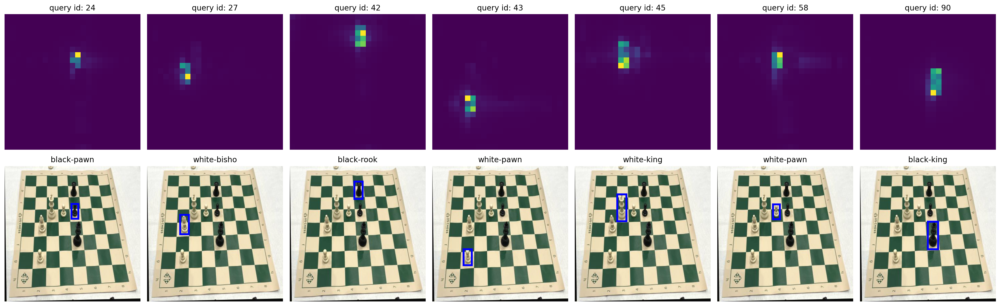

# DETR for recognition of real chess game

## Abstract

We explore the power of the Transformer architecture in the object detection task. Given an image, the model (DETR) has to predict bounding boxes associated with a class. This novel and elegant approach, is using the best features of both CNNs and Transformers by omitting a lot of previously hand crafted features and achieving accuracies comparable to state of the art vision systems. We apply this approach on a chess dataset, with the goal of extracting the state of the game by detecting all pieces and the chessboard corners. Finally we compare DETR with YOLO performances.

## Pipeline

    <figure>
        
    </figure>

## Visualization of the last decoder attentions weights

    <figure>
        
    </figure>

## Load Data and Models

Donload the zip in our drive to obtain the datasets, images and loaded models

https://drive.google.com/drive/u/3/folders/1aTZi5nNKx0bhO8nB74nx3trsIEwFLFLG

 
## Sources

DETR:

https://github.com/roboflow/notebooks/blob/main/notebooks/train-huggingface-detr-on-custom-dataset.ipynb

YOLO:

https://github.com/roboflow/notebooks/blob/main/notebooks/train-yolo-nas-on-custom-dataset.ipynb

Real-Life Chess Vision:

https://github.com/shainisan/real-life-chess-vision

DETR last head transformer:

https://github.com/facebookresearch/detr
